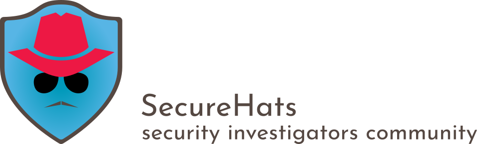

=========

# SecureHacks - Script

SecureHacks is a project to discover Azure & Azure AD permissions with a comprimised account. 
This can be useful to discovery vulnerabilities in IAM configurations within a environment.

**_WARNING! The code is for Proof of Concept only and should not be used in production without explict approval of the owner._**

#### Prerequisites

- Access to an Azure (AD) environment
- User Account
